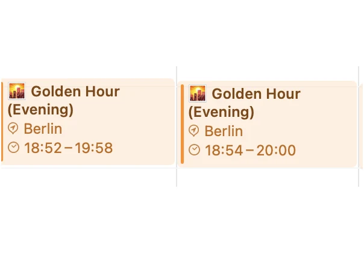
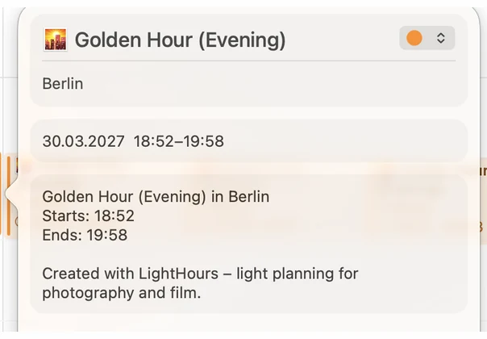

<picture>
  <source media="(prefers-color-scheme: dark)" srcset="assets/img/readme-dunkel.png">
  
</picture>

[](CHANGELOG.md)
[](LICENSE)
[](https://www.php.net/)
[](#installation)

**[lighthours.app](https://lighthours.app)** · [Deutsche Fassung](README.de.md)

Golden hour and blue hour for any place on earth, delivered as a calendar you
subscribe to once and never think about again. No app, no account, no email
required.

Plain PHP and JavaScript. No database, no Composer, no build step. Upload it to
the cheapest shared hosting you can find and it runs.

---

## What it looks like

<picture>
  <source media="(prefers-color-scheme: dark)" srcset="assets/img/screens/kalender-woche-dunkel.webp">
  
</picture>
<picture>
  <source media="(prefers-color-scheme: dark)" srcset="assets/img/screens/kalender-termin-dunkel.webp">
  
</picture>

Two days in a row in Berlin: 18:52, then 18:54. Golden hour shifts by a minute
or two every day — nobody keeps that in their head. That is the entire point.

---

## Why bother

There are excellent apps for this. PhotoPills and Sun Surveyor do far more than
this does — planning, augmented reality, milky way. They all share one property:
you have to open them.

This does the one thing they don't. The times sit in the calendar you already
check every morning, next to your shoots. Nothing to open, nothing to remember.

---

## Accuracy

Sun position uses the full NOAA algorithm including **atmospheric refraction**,
so it works with the *apparent* altitude — where the sun actually appears, not
where pure geometry puts it. Near the horizon that is roughly two minutes of
difference, which is exactly where it matters.

| Phase | Sun altitude |
|---|---|
| Golden hour | −4° to +6° |
| Blue hour | −6° to −4° |

Verified against an independent implementation (Python/Astral) across a full
year at six locations from Reykjavík to Sydney:

| | |
|---|---|
| Mean deviation | **0.9 seconds** |
| Worst case | 3 seconds |
| Comparisons | 12,709 |

Two details that most implementations get wrong:

- **Events are anchored to the local date**, not the UTC date. Without that,
  a calendar for Sydney puts the morning golden hour on the wrong day.
- **Near the poles, non-existent phases are omitted** rather than given an
  invented time. On 21 December in Reine, Lofoten, you get blue hour but no
  golden hour — the sun peaks at −1.4°, so it crosses −4° but never +6°.

---

## Features

- Search by city, address, region or postcode — never coordinates
- Interactive map with a draggable centre and a selectable validity radius
- Shows the maximum time deviation within that radius, so one calendar covers
  your whole region instead of one per location
- Period from 3 months to 5 years, or a custom end date
- **Rolling subscription** that moves with the date and never runs empty
- Optional reminder 15, 30 or 60 minutes before a phase starts
- Proper `VTIMEZONE` with daylight saving transitions
- Stable event UIDs, so calendar apps don't create duplicates
- Light and dark mode, following the system or set manually
- Six languages — including the calendar events themselves

---

## Installation

1. Upload the contents of this repository to your web root
2. In `lib/config.php`, set a real contact address:

   ```php
   const LH_USER_AGENT = 'lighthours/' . LH_VERSION . ' (+https://your-domain.com; you@your-domain.com)';
   ```

   This is not a formality. Nominatim, OpenStreetMap's free geocoder, rejects
   requests with placeholder addresses using HTTP 403 — by far the most common
   reason the search finds nothing.

3. Open `check.php` in a browser. It verifies PHP version, extensions, outgoing
   connections, the calculation and the place search, and names the next step
   for anything that fails. Delete it once everything passes.

**Requires** PHP 8.1 or newer. The extensions it needs (`mbstring`, `json`,
`date`) are present everywhere; place search uses `curl` or falls back to
`allow_url_fopen`.

**Optional:** a writable `cache/` directory speeds up repeated searches and
takes load off OpenStreetMap. It is created automatically if permissions allow.

---

## Configuration

Everything lives in `lib/config.php`.

| Setting | Purpose |
|---|---|
| `LH_USER_AGENT` | Contact address for the place search — **required** |
| `LH_BASE_URL` | Public address, used for canonical URLs and subscription links |
| `LH_AUTHOR` | Operator name for structured data, empty omits it |
| `LH_SOURCE_URL` | Link to the source, empty hides the footer link |
| `LH_COFFEE_USER` | Buy Me a Coffee username, empty hides the support section |
| `LH_MAIL_ENABLED` | Optional email delivery of the subscription link, off by default |
| `LH_SMTP_*` | SMTP access — usually more reliable than `mail()` on shared hosting |
| `LH_STATS_ENABLED` | Anonymous count of active calendars |
| `LH_STATS_MIN_DISPLAY` | Threshold below which the count stays hidden |
| `LH_MAX_MONTHS` | Upper limit for the calendar period |
| `LH_CACHE_DIR` | Cache directory, empty disables caching |

---

## API

All endpoints return JSON and allow cross-origin requests.

```
GET api/times.php?lat=53.5511&lon=9.9937&days=3&tz=Europe/Berlin&lang=en
GET api/geocode.php?q=Hamburg&lang=en&country=DE
GET api/deviation.php?lat=53.55&radius=100
GET calendar.php?lat=53.5511&lon=9.9937&months=24&rolling=1
```

### Calendar parameters

| Parameter | Values | Default |
|---|---|---|
| `lat`, `lon` | coordinates | required |
| `events` | `golden_morning`, `golden_evening`, `blue_morning`, `blue_evening` | all |
| `months` | 1–60 | 12 |
| `end` | custom end date `YYYY-MM-DD` | – |
| `rolling` | `1` = always the coming `months` from today | off |
| `tz` | time zone identifier | derived from coordinates |
| `lang` | `de`, `en`, `it`, `fr`, `es`, `pt` | `de` |
| `reminder` | minutes before start | none |
| `name` | display name of the place | coordinates |

Use `rolling=1` for subscriptions — the calendar then moves with the date and
never runs empty.

---

## Privacy

- No cookies, no accounts, no tracking, no ads
- Fonts and the map library are self-hosted — **nothing loads from Google or a
  CDN**
- Place search runs server-side, so search terms reach OpenStreetMap without
  the visitor's IP address
- Map tiles are loaded by the browser directly from openstreetmap.org, and only
  after a place has been selected
- Active calendars are counted anonymously via a hash of the calendar settings,
  without IP address and without a timestamp

The only thing stored client-side is the chosen colour mode, in `localStorage`.

---

## Architecture

```
index.php              Home page and generator
calendar.php           Calendar output (ICS)
check.php              Post-upload self-check
datenschutz.php        Privacy statement
impressum.php          Legal notice (German requirement)
sitemap.php            Sitemap, generated from the available languages
robots.php             robots.txt, generated from the configuration
api/                   times, geocode, deviation, send
lib/
  Sun.php              Sun position (NOAA algorithm)
  LightPhases.php      Golden and blue hour
  Ics.php              iCalendar output with VTIMEZONE
  Timezone.php         Time zone from coordinates
  Geocoder.php         Place search
  Stats.php            Anonymous count
  Mailer.php           SMTP client without dependencies
  RateLimit.php        Abuse throttle
  Cache.php            File cache
  I18n.php             Translations
  config.php           Configuration
lang/                  de en it fr es pt
legal/                 Privacy and legal notice text (de, en)
partials/              Shared head, footer and legal page scaffold
assets/                Fonts, images, CSS, JS, MapLibre
tests/run.php          93 tests, no framework
```

Modules under `lib/` know about each other only where necessary and can be used
individually.

---

## Adding a language

Copy `lang/en.php`, translate the values, save it as `lang/<code>.php`. The
language appears in the switcher automatically — no code changes. The test suite
verifies that every language carries the same set of keys and that placeholders
like `{minutes}` survived translation.

---

## Tests

```bash
php tests/run.php
```

93 checks covering the astronomy against reference values, ICS structure and
line folding, time zone resolution, translation completeness, design tokens and
the search-engine basics. No framework, no dependencies.

---

## Design

Colours, sizes, spacing and the rules for the logo are documented in
[DESIGN.md](DESIGN.md) *(in German)*. Every value lives in
`assets/css/tokens.css`.

The mark is three stacked bars running from gold to blue — the horizon as bands
of light. The typeface is Outfit, variable and self-hosted at 45 KB total.

---

## Licence

MIT — see [LICENSE](LICENSE). Use it, change it, redistribute it, sell it.

**The name "lighthours" and the logo are not covered by that licence.** Forks
and self-hosted instances are welcome, but please use your own name and mark —
see [NOTICE.md](NOTICE.md). Running an unmodified instance and noting that it is
based on lighthours is explicitly fine.

Fonts: Outfit under the SIL Open Font License 1.1.
MapLibre GL JS under the 3-Clause BSD License.
Place data © OpenStreetMap contributors, ODbL.
